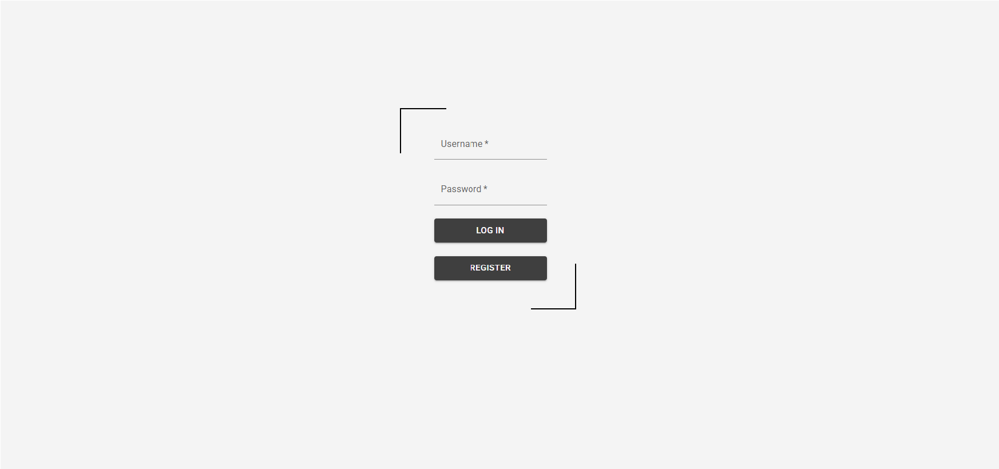
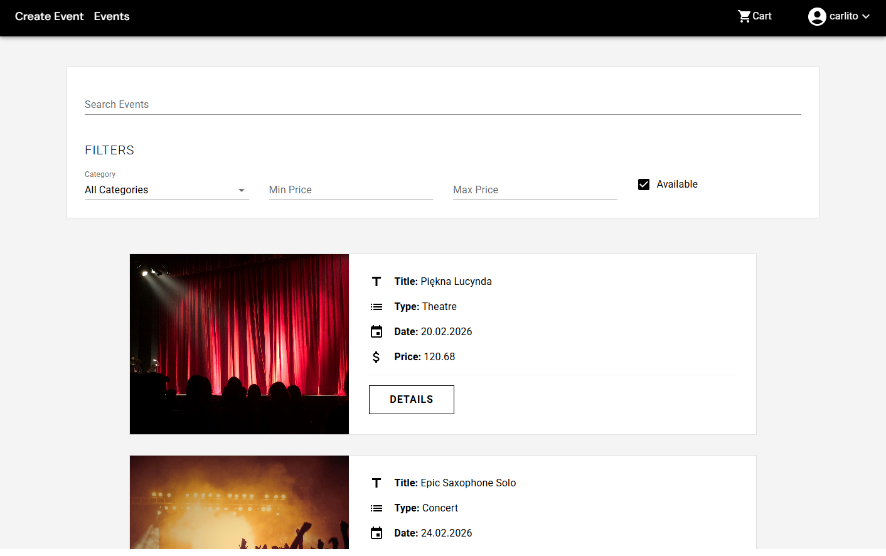
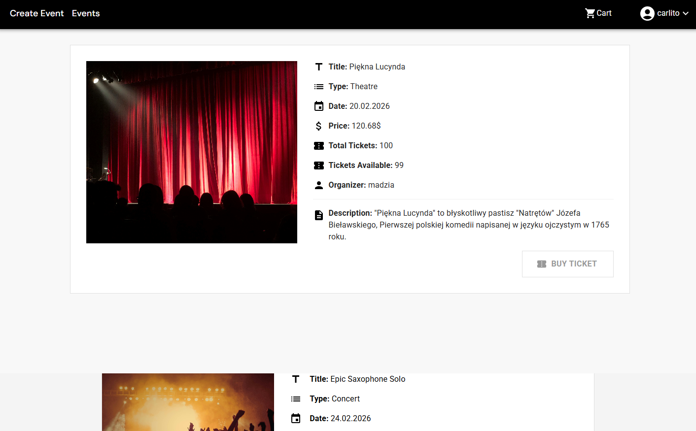
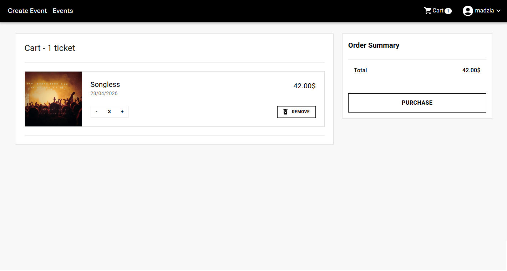
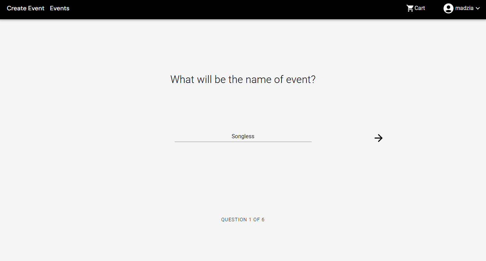
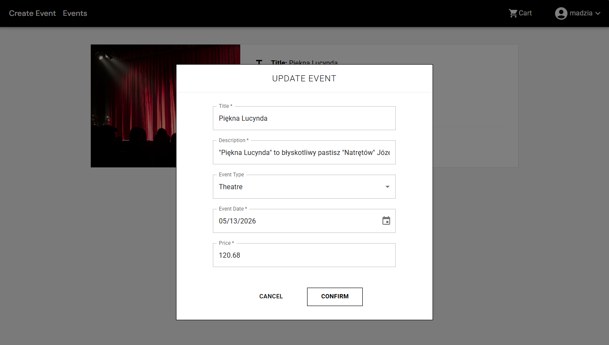
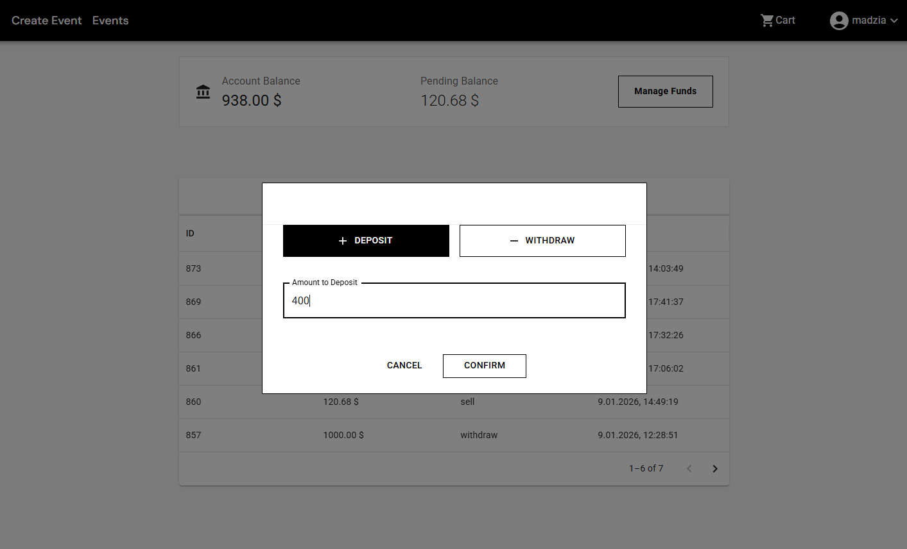

## Widok Logowania
Możliwość korzystania z funkcjonalności systemu dostępna jest po uprzednim zalogowaniu się na konto użytkownika. Widok logowania (Rys.5.8) zawiera formularz, który wymaga uzupełnienia nazwy użytkownika oraz hasła.

*Rysunek 5.8 Formularz logowania do systemu*

Dla zachowania bezpieczeństwa przy wprowadzaniu hasła zostaje ono ukryte zastępując wpisywane hasło znakiem „*” lub „•” . Formularz zawiera także przycisk „REGISTER” przekierowujący użytkownika na stronę rejestracji.

## Widok dostępnych wydarzeń
Wydarzenia zostały zaimplementowane w postaci kafelków, zawierających zdjęcie odpowiadające kategorii oraz kluczowe informacje. W celu szybszego wyszukiwania wydarzeń wdrożono panel filtrujący (Rys.5.1) pozwalający dostosować wyniki do preferencji użytkownika.

*Rysunek 5.1 Widok listy wydarzeń z panelem filtrującym*

Przycisk „DETAILS” przekierowuje użytkownika do widoku związanego z wybranym wydarzeniem, który przedstawia szczegóły wydarzenia (Rys.5.2.1) oraz umożliwia dodanie biletu do koszyka.

## Widok szczegółów wydarzenia
Po wybraniu konkretnej pozycji z listy wydarzeń przedstawionej na (Rys.5.1.1), użytkownik zostaje przekierowany do widoku szczegółowego (Rys.5.2.1), prezentującego dodatkowe informacje. 

*Rysunek 5.2 Widok szczegółów wydarzenia*

Widok ten zawiera rozszerzone dane, takie jak: szczegółowy opis wydarzenia, całkowita liczba biletów, liczba dostępnych miejsc oraz nazwa organizatora. Zaimplementowano także przycisk „BUY TICKET”, który domyślnie dodaje 1 bilet do koszyka.

## Widok koszyka
Przejście do widoku koszyka odbywa się poprzez kliknięcie odpowiedniej ikony zawierającej licznik dodanych pozycji do zamówienia (Rys.5.3).

*Rysunek 5.3 Koszyk i podsumowanie zamówienia*

Widok ten przedstawia aktualne bilety znajdujące się w koszyku wraz z ich cenami. Zaimplementowano mechanizm pozwalający na modyfikację liczby biletów oraz usuwanie pozycji z listy, co natychmiastowo aktualizuje całkowitą kwotę do zapłaty. Realizacja zamówienia odbywa się poprzez kliknięcie przycisku „PURCHASE”, który pobiera daną kwotę od kupującego i odpowiednio dystrybuuje ją pomiędzy organizatorami.

## Widok tworzenia wydarzeń
Proces dodawania nowych wydarzeń realizowany jest poprzez dynamiczny formularz (Rys. 5.5), który dostępny jest po wybraniu zakładki „Create Events” na pasku nawigacyjnym.

*Rysunek 5.5 Formularz dodawania nowego wydarzenia*

Formularz ten wymaga uzupełnienia szczegółowych danych, takich jak: tytuł, opis, kategoria, data oraz cena biletu. System powiązuje wybraną kategorie z tematycznym obrazem co ułatwia przeglądanie wydarzeń.

## Widok edycji wydarzenia
Aktualizowanie informacji o wydarzeniu możliwe jest po wybraniu opcji „My Events” w menu nawigacyjnym, a następnie kliknięciu przycisku „Update” przy konkretnym wydarzeniu. Akcja ta otwiera formularz edycji wydarzenia (Rys.5.6).

*Rysunek 5.6 Widok edycji danych wydarzenia*

Formularz ten jest wstępnie wypełniony aktualnymi danymi z bazy, co pozwala na szybką poprawę informacji bez konieczności uzupełniania wszystkich pól od nowa.

## Widok zarządzania środkami
Dostęp do panelu finansowego odbywa się poprzez klikniecie przycisku „Manage Funds”. Akcja ta powoduje wyświetlenie okna dialogowego, zawierającego opcję zarządzania saldem (Rys.5.7).

*Rysunek 5.7 Panel zarządzania środkami*

Widok ten udostępnia dwie funkcjonalności: wpłatę „Deposit” oraz wypłatę „Withdraw” środków. Zaimplementowano tu mechanizm symulacji transakcji, który po zatwierdzeniu kwoty natychmiastowo aktualizuje saldo konta użytkownika, odpowiednio zwiększając lub zmniejszając dostępne fundusze.
